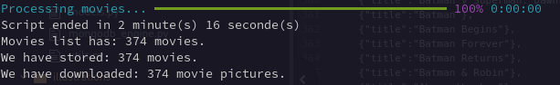

# DUMMY APP FOR LEARNING PURPOSES

This dummy app involves web scraping and using MongoDB with Python.

The aim is to create a personal movie database with illustration pictures for each movie, which can then be used in other projects.

We take advantage of the IMDb website.

We are going to store "movies" in a MongoDB database, based on a JSON file supplied by the user.

This file ("app/application_dummy_movies.json") consists of a list of dictionaries, each representing a movie, which can be either fictious or real.

Below is an example.

**The title key is the only mandatory one**. Others will have the default values you set if there's no match with the IMDb database.

    [
        {
          "title": "The Duckfather",
          "genres": ["comedy"],
          "year":1972,
          "rating":9.2,
          "description":"A comedic tale of a duck who becomes the leader of a crime family."
        },
        (...)
    ]

The main function will loop through the list. For each dictionary, a "Movie" instance is created and then added to a "movies list". After that, the main function calls asyncio to execute the tasks.

An asyncio task consists in (for example):
- GET: https://www.imdb.com/search/title/?title=lethal%20weapon&title_type=feature&genres=

  We check if a cinema movie exists on IMDb based on his title. If user set a genre in the "app/application_dummy_movies.json" file the search will be:

  GET: https://www.imdb.com/search/title/?title=lethal%20weapon&title_type=feature&genres=action

- If the movie exists, then GET: https://www.imdb.com/title/tt0093409/?ref_=fn_al_tt_1

  We then retrieve IMDb genres, description and URL for the illustration image.

- If the movie exists, once we have the "genres, description, etc", then GET: https://www.imdb.com/title/tt0093409/mediaviewer/rm63577088/?ref_=tt_ov_i

  We download the image itself into the "app/movies_pictures" folder.

## TECHNOLOGIES
Python 3.11 and later

Asyncio

MongoDB (as a Docker image)

## HOW RUN IT ?

At the project root folder, touch (create) a ".env" file (the default name a docker compose will look for). Set something like this:

    export MONGO_SERVER="localhost"
    export MONGO_PORT="27017"
    export MONGO_DB="movies_db"
    export MONGO_TEST_DB="movies_test_db"
    export MONGO_INITDB_ROOT_USERNAME="admin"
    export MONGO_INITDB_ROOT_PASSWORD="superP@ssword"

  source .envrc

  python -m venv venv

  source venv/bin/activate

  pip install -r requirements.txt

  docker compose -f docker-compose.yml up -d --build

  python app/main.py

In my context i obtain:

  

## TO RUN TESTS
**I use unittest which does not support async/await. Tests need to be improved with pytest pytest-asyncio.**

    export PYTHONPATH=$PYTHONPATH:./app

    python -m unittest

## STOP AND PURGE

  docker compose down

  docker volume rm dummy_mongodb_imdb_movies_mongo-data

## HOW USE IT ?
The project will be loaded as a submodule. We want people to have access to a ready-to-use database and illustration pictures.

Once the code executed we dump the database into app/db_dump folder.

    docker exec dummy_mongodb_movies mongodump --db movies_db --out /data/db/dump --username admin --password superP@ssword --authenticationDatabase admin

    docker cp dummy_mongodb_movies:/data/db/dump ./app/db_dump

Then people can use the database it. First copy it on container then restore.

    docker cp app/db_dump/dump/movies_db/ dummy_mongodb_movies:/data/db/dump

    docker exec dummy_mongodb_movies mongorestore --db movies_db /data/db/dump/movies_db --username admin --password superP@ssword --authenticationDatabase admin

### USEFULL LINKS

For asyncio: https://realpython.com/python-concurrency/

To understand how use the rich progress bar in this asynchronous context and avoid to lost request: https://chatgpt.com
